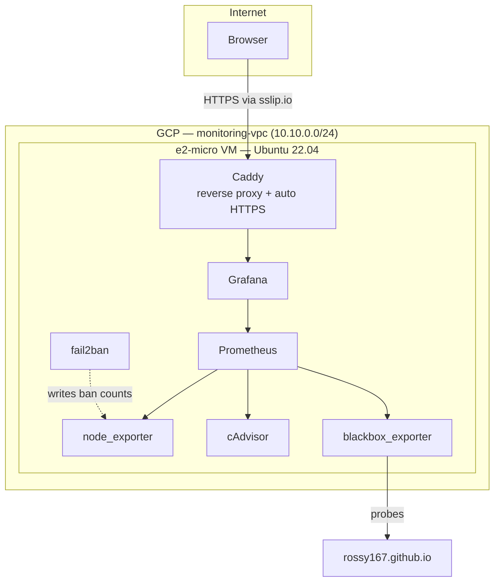

# cloud-monitoring-stack

A self-hosted observability stack on GCP, provisioned entirely by Terraform — one `terraform apply` brings up a VM, networking, and a full Prometheus + Grafana stack with no manual SSH steps. Free tier throughout: `e2-micro` compute, a single static IP, and no domain purchase required (see the HTTPS note below). One exception: the GCS bucket used for remote Terraform state carries a small recurring cost, typically cents/month at this scale (see [Remote state](#remote-state)).

## What it watches

Four layers, so the dashboard tells a real story instead of one server's CPU graph:

| Layer | Tool | What it shows |
|---|---|---|
| Host | node_exporter | CPU, memory, disk, network on the VM itself |
| Containers | cAdvisor | Per-container resource usage for the stack |
| External service | blackbox_exporter | Uptime + latency, probing my portfolio site |
| Security | fail2ban + a textfile exporter | Banned SSH brute-force attempts |

The same blackbox probe also yields TLS certificate expiry for free — `probe_ssl_earliest_cert_expiry` comes from any `https://` target without extra config.

Prometheus evaluates a set of alert rules (`monitoring/prometheus/rules/alerts.yml`) covering target availability, host resource pressure, container restarts, blackbox probe failures, and fail2ban ban spikes, and routes firing alerts to an internal Alertmanager. Alertmanager forwards them to a webhook (`alertmanager_webhook_url` in `terraform.tfvars`) if one is configured, or is a safe no-op otherwise.

## Architecture



## Prerequisites

- A GCP project with billing enabled
- [Terraform](https://developer.hashicorp.com/terraform/install) >= 1.5 (`brew install terraform` on macOS)
- `gcloud` CLI authenticated (`gcloud auth application-default login`)
- An SSH key pair (`ssh-keygen -t ed25519` if you don't have one)

Terraform enables the Compute Engine API (`compute.googleapis.com`) itself as part of `apply` — you do not need to run `gcloud services enable compute.googleapis.com` manually on a fresh project. For that to succeed, the identity running `apply` needs the `serviceusage.services.enable` IAM permission, which is included in the Owner and Editor roles.

## Repo layout

```
.
├── terraform/          # run terraform here — this is the only thing you execute directly
└── monitoring/         # source configs, consumed as templates by Terraform's cloud-init —
                         # not meant to be run directly with `docker compose up` from this folder
```

## Setup

```bash
cd terraform
cp terraform.tfvars.example terraform.tfvars
# edit terraform.tfvars: fill in project_id, ssh_user, ssh_pub_key_path,
# ssh_source_ranges, grafana_admin_password (see inline comments in the file)

terraform init
terraform apply
```

`terraform.tfvars` is gitignored — never commit it, it holds your Grafana password.

Note: `terraform init` above needs the `-backend-config` flags described in [Remote state](#remote-state) below — a bare `terraform init` will prompt for them interactively.

Once `apply` finishes, give the VM 2–3 minutes to finish its first-boot setup (installing Docker, pulling images, starting the stack), then open the `grafana_url` from the Terraform output. Log in with `admin` / whatever you set as `grafana_admin_password` — the "Infrastructure Overview" dashboard is already provisioned and loaded.

## Verifying / troubleshooting a first apply

If `grafana_url` isn't up after a few minutes:

1. SSH in with the `ssh_command` Terraform output (`terraform output ssh_command`).
2. Run `sudo cloud-init status` — should say `status: done`. If it says `running`, wait longer; if `error`, continue below.
3. If cloud-init failed, check `sudo journalctl -u google-startup-scripts.service --no-pager | tail -100` for the failing step.
4. Check the stack itself: `cd /opt/monitoring && sudo docker compose ps` to see container status, then `sudo docker compose logs <service>` (e.g. `caddy`, `grafana`, `prometheus`) for any container that isn't `Up`/healthy.

## Remote state

Terraform state for this project is stored remotely in a GCS bucket rather than on your local disk. This is safer for anything you intend to keep running (no risk of losing `terraform.tfstate` locally) and is a prerequisite for ever collaborating on this repo.

The backend configuration in `terraform/versions.tf` is intentionally partial (`backend "gcs" {}`, no bucket name) — the bucket name is account-specific and should never be hardcoded/committed to this repo.

One-time setup, before your first `terraform init`:

1. Manually create a GCS bucket for state (this is deliberately not Terraform code — a `google_storage_bucket` resource can't create the bucket that Terraform needs in order to store the state describing that resource). Do this once, either via the GCP Console (Cloud Storage, Create bucket) or with the storage bucket creation command of your preferred CLI, choosing a globally-unique name. Enabling versioning on the bucket is recommended so you can recover an earlier state file if needed.
2. Initialize Terraform with your bucket name supplied at init time, instead of a bare `terraform init`: run Terraform's init command with `-backend-config="bucket=YOUR_UNIQUE_BUCKET_NAME"` and `-backend-config="prefix=terraform/state"`.

This only needs to be done once (or again if you ever re-run init with a different bucket). This GCS bucket is the one piece of this project's cost that falls outside GCP's Always Free tier — typically a few cents a month for a state file this small.

## On HTTPS without a domain

This uses [sslip.io](https://sslip.io) — a free service that resolves `<any-ip>.sslip.io` to that literal IP. Since it's real, publicly resolvable DNS, Caddy can get you a genuine Let's Encrypt certificate for it automatically. No domain purchase needed to get real HTTPS. If you later buy a domain, swap it into `caddy/Caddyfile.tftpl` and re-apply.

## Security notes

- `ssh_source_ranges` (`variables.tf`) has no default — Terraform will refuse to `apply` until you set it in `terraform.tfvars`, e.g. `ssh_source_ranges = ["203.0.113.4/32"]`. This forces a conscious choice of allowed CIDR ranges instead of silently opening SSH to the world.
- Only ports 80, 443, and 22 are open at the network level; everything else (Prometheus, the exporters) is internal-only, reachable by other containers but not the public internet.
- fail2ban runs on the host and bans repeated failed SSH logins automatically — its ban count is what feeds the dashboard's security panel.
- A 2GB swapfile (low `vm.swappiness`) is provisioned on first boot as an emergency cushion against the OOM killer on this memory-constrained `e2-micro`, not as routine paging.
- Grafana's Public Dashboards feature is enabled (`GF_FEATURE_TOGGLES_ENABLE=publicDashboards` in `monitoring/docker-compose.yml.tftpl`), which allows one specific dashboard to be marked publicly viewable, read-only, with no login. This is distinct from — and does not enable — Grafana's anonymous-access feature (`GF_AUTH_ANONYMOUS_ENABLED`), which would open the whole instance; that is deliberately left unset. No dashboard is public by default — marking one public is a manual, post-deploy step done via Grafana's UI (Share > Public dashboard) or its API, not something Terraform manages.

## Teardown

```bash
cd terraform
terraform destroy
```

## Verification

Every config file here is checked for correctness before being committed — Terraform HCL parses cleanly, and the cloud-init template is fully rendered with mock values to confirm every embedded file (Docker Compose stack, Prometheus config, Grafana dashboard JSON, fail2ban script) base64-decodes correctly and produces valid YAML/JSON.

This has also now been confirmed end-to-end with a real `terraform apply` against a live GCP project: all 7 containers come up healthy, Grafana serves the dashboard over HTTPS via sslip.io, every Prometheus scrape target reports `up`, Alertmanager is reachable, the fail2ban `sshd` jail is active, and the swapfile is live with the configured swappiness. One real bug only showed up at this stage — see the note below — everything since has deployed clean on a from-scratch VM.

**A note on the one bug a static review couldn't catch**: the very first live `apply` deployed a VM where `cloud-init status` reported `done`, but none of the actual stack came up. The cause: the compose/prometheus/cloud-init templates were correct, but `terraform/main.tf` was passing the rendered `#cloud-config` YAML into Terraform's `metadata_startup_script` argument, which sets GCP's `startup-script` metadata key — executed as a literal bash script by `google-startup-scripts.service`, never parsed by cloud-init. Cloud-init only reads its own YAML config from the `user-data` metadata key. Every review this project's `idea → coder → supervisor` loop ran had validated that the rendered YAML was itself correct, but none of them could catch a wrong *delivery mechanism*, since that only manifests on a real boot against a real GCP project. Fixed by moving the `templatefile(...)` call into `metadata["user-data"]` instead.
