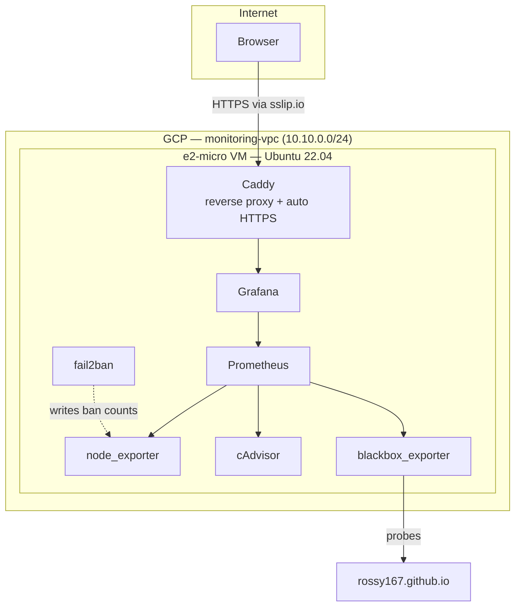

# cloud-monitoring-stack

A self-hosted observability stack on GCP, provisioned entirely by Terraform — one `terraform apply` brings up a VM, networking, and a full Prometheus + Grafana stack with no manual SSH steps. Free tier throughout: `e2-micro` compute, a single static IP, and no domain purchase required (see the HTTPS note below).

## What it watches

Four layers, so the dashboard tells a real story instead of one server's CPU graph:

| Layer | Tool | What it shows |
|---|---|---|
| Host | node_exporter | CPU, memory, disk, network on the VM itself |
| Containers | cAdvisor | Per-container resource usage for the stack |
| External service | blackbox_exporter | Uptime + latency, probing my portfolio site |
| Security | fail2ban + a textfile exporter | Banned SSH brute-force attempts |

The same blackbox probe also yields TLS certificate expiry for free — `probe_ssl_earliest_cert_expiry` comes from any `https://` target without extra config.

## Architecture



## Prerequisites

- A GCP project with billing enabled
- [Terraform](https://developer.hashicorp.com/terraform/install) >= 1.5 (`brew install terraform` on macOS)
- `gcloud` CLI authenticated (`gcloud auth application-default login`)
- An SSH key pair (`ssh-keygen -t ed25519` if you don't have one)

## Repo layout

```
.
├── terraform/          # run terraform here — this is the only thing you execute directly
└── monitoring/         # source configs, consumed as templates by Terraform's cloud-init —
                         # not meant to be run directly with `docker compose up` from this folder
```

## Setup

```bash
cd terraform
cat > terraform.tfvars <<EOF
project_id              = "your-gcp-project-id"
ssh_user                = "your-username"
ssh_pub_key_path        = "~/.ssh/id_ed25519.pub"
grafana_admin_password  = "pick-something-here"
EOF

terraform init
terraform apply
```

`terraform.tfvars` is gitignored — never commit it, it holds your Grafana password.

Once `apply` finishes, give the VM 2–3 minutes to finish its first-boot setup (installing Docker, pulling images, starting the stack), then open the `grafana_url` from the Terraform output. Log in with `admin` / whatever you set as `grafana_admin_password` — the "Infrastructure Overview" dashboard is already provisioned and loaded.

## On HTTPS without a domain

This uses [sslip.io](https://sslip.io) — a free service that resolves `<any-ip>.sslip.io` to that literal IP. Since it's real, publicly resolvable DNS, Caddy can get you a genuine Let's Encrypt certificate for it automatically. No domain purchase needed to get real HTTPS. If you later buy a domain, swap it into `caddy/Caddyfile.tftpl` and re-apply.

## Security notes

- SSH is open to `0.0.0.0/0` by default (`ssh_source_ranges` in `variables.tf`) — override this with your own IP once you know it. This is the first thing I'd lock down before leaving this running long-term.
- Only ports 80, 443, and 22 are open at the network level; everything else (Prometheus, the exporters) is internal-only, reachable by other containers but not the public internet.
- fail2ban runs on the host and bans repeated failed SSH logins automatically — its ban count is what feeds the dashboard's security panel.

## Teardown

```bash
cd terraform
terraform destroy
```

## Verification

Every config file here has been checked for correctness before being committed: the Terraform HCL parses cleanly (`terraform-config-inspect`, zero diagnostics), and the cloud-init template has been fully rendered with mock values to confirm every embedded file — the Docker Compose stack, Prometheus config, Grafana dashboard JSON, and the fail2ban script — base64-decodes correctly and produces valid YAML/JSON. What hasn't been done yet is an actual `terraform apply` against a live GCP project — that's the next step.
